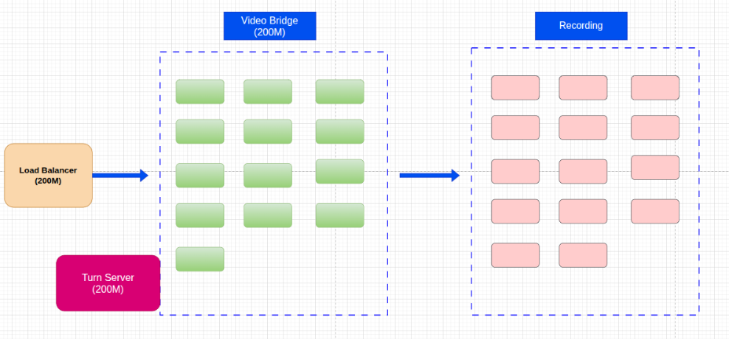
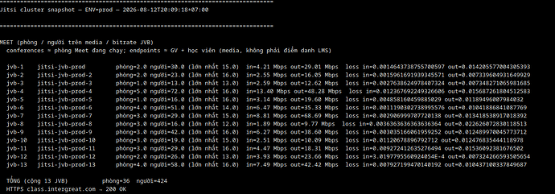
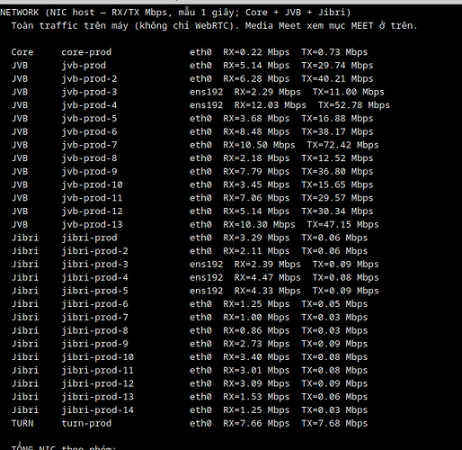

# Cluster Architecture

Eventually the JITSI app needs to be able to support many users at ones. for that I found an architecture that I think I might be able to replicate given time. Since I am already using docker compose. Here is the link to that architecture.

[Jitsi-org-cluster-solution](https://community.jitsi.org/t/can-this-existing-small-class-cluster-support-a-500-person-webinar-or-what-extra-do-we-need/142569)

We have a self-hosted Jitsi Meet cluster (Docker, single shard) used as an LMS classroom system. Before we promise a webinar product, we want to know whether this setup can handle it, or what we would have to add.

### Current setup

- 1 Core: web + Prosody + Jicofo
- 13 JVBs — a conference stays on one JVB for the whole session (no OCTO, no Visitors)
- 1 TURN server
- 14 Jibri machines × 3 instances each = 42 concurrent recorders
- JWT auth, lobby / wait-for-host, custom Prosody modules (affiliation, LMS webhooks)
- Client: disableSimulcast, 360p, channelLastN = 15
Each JVB machine

- 4 CPU cores / 8 GB RAM
- 200 Mbps uplink per machine (not shared across the cluster)
- Normal production load (this works today)

- 40+ concurrent classes
- ~15 students per class
- So ~600+ interactive participants cluster-wide, spread -across many rooms / 13 JVBs

## What we have seen

The cluster is fine when load is many small rooms.
One JVB with ~60 participants already hits high CPU.
A single room cannot use the other JVBs.
What we want A webinar of about 500 people (a few speakers, the rest mostly watching). We must not break the existing small-class product.

**Questions**

- With the hardware and topology above, can a single ~500-person webinar run on this cluster as-is?
If not, what is the minimum we need to add (Visitors, OCTO, extra JVBs, more CPU/RAM/bandwidth, a separate shard/domain, …)?
If the recommended path is Visitors or OCTO: can we add it without affecting the current 15-person classes?
Thanks.

## **Solution**
You need to enable OCTO so a room can span multiple JVBs.